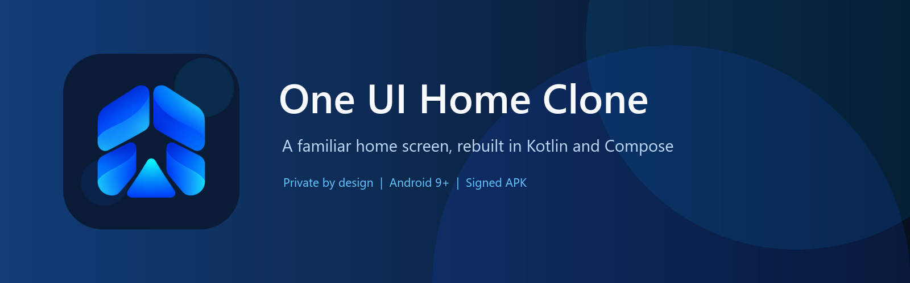
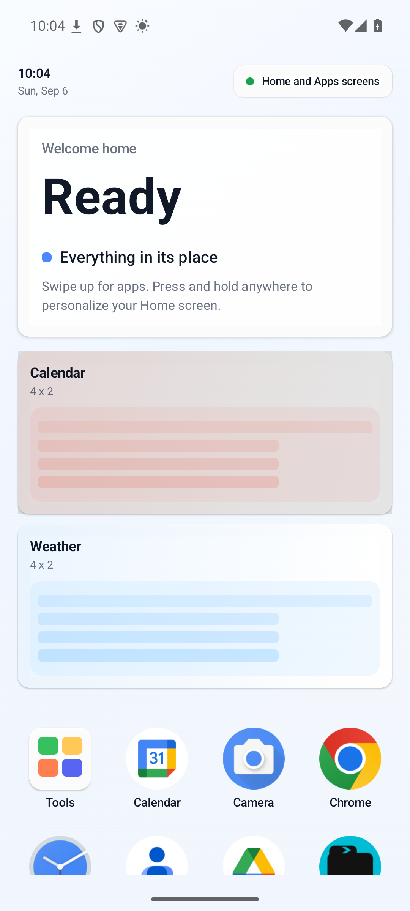
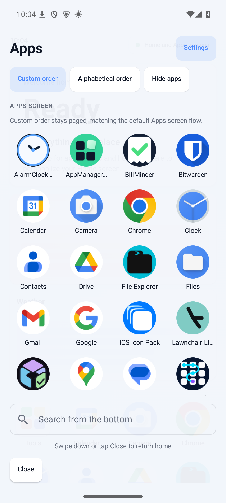
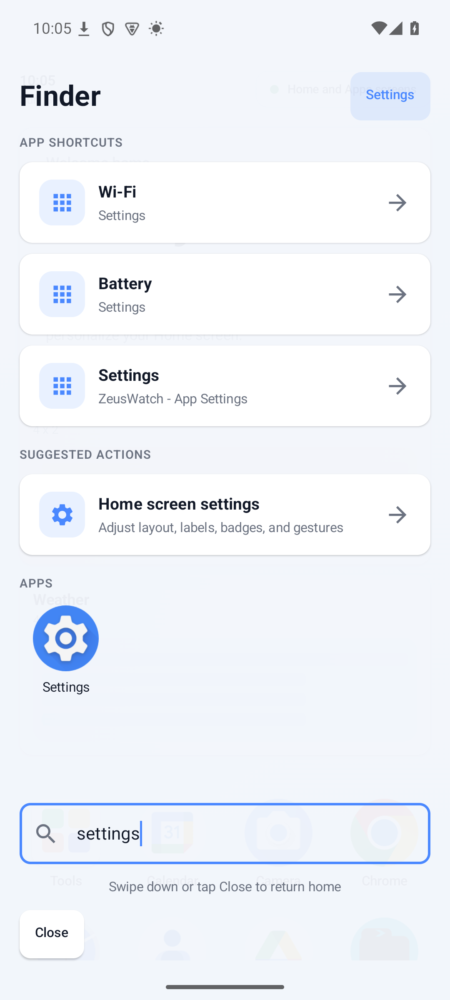
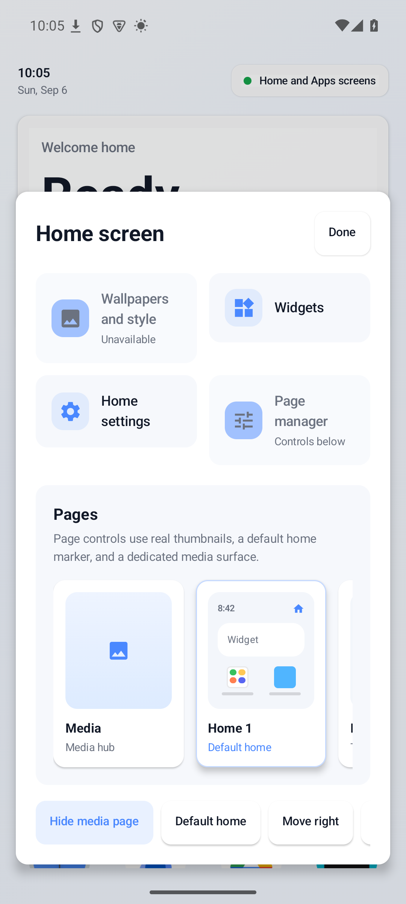
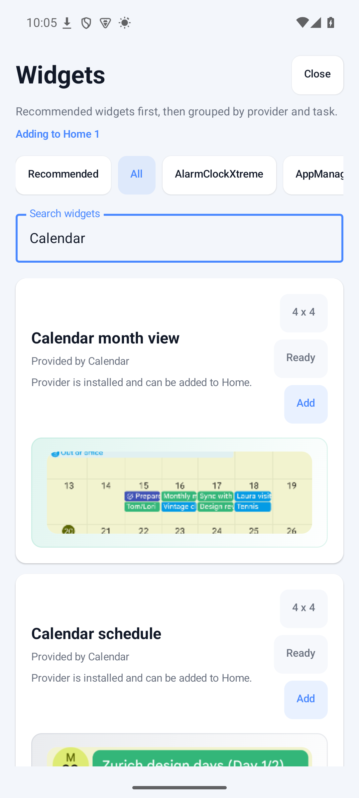
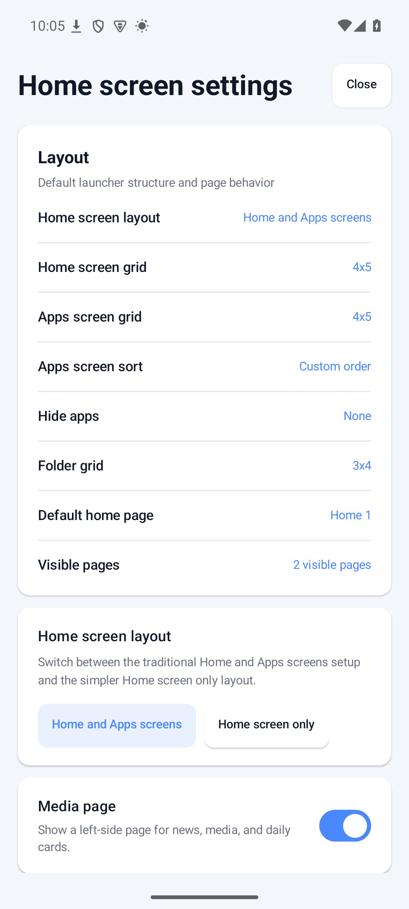

[](https://github.com/SysAdminDoc/one-ui-home-clone/releases/latest)
[](LICENSE)
[](prototype-android/app/build.gradle.kts)
[](prototype-android/)

One UI Home Clone is an independent Android launcher for people who like Samsung's familiar home-screen flow and want an open Kotlin and Compose implementation. It is a clone, not a port. No Samsung code, logos, wallpapers, or proprietary glyphs are included.

[Download the signed APK](https://github.com/SysAdminDoc/one-ui-home-clone/releases/latest/download/one-ui-home-clone-v0.2.5-release.apk) · [View the release notes](https://github.com/SysAdminDoc/one-ui-home-clone/releases/latest)

## See it in action

The screenshots below come from the signed v0.2.5 APK running on an isolated Android 15 emulator.

| Home | Apps | Finder |
| --- | --- | --- |
|  |  |  |

| Edit mode | Widgets | Home settings |
| --- | --- | --- |
|  |  |  |

## Why install it

- The Home and Apps screens follow the interaction model Samsung users already know.
- Finder searches installed apps, launcher settings, actions, shortcuts, and optional local contacts.
- Home pages support folders, app shortcuts, notification badges, widgets, grid controls, and a dedicated edit surface.
- Phone portrait, landscape, foldable-width, and tablet layouts use separate responsive grid contracts.
- Standard and reduced motion modes respond immediately without restarting the activity.
- Local backup, restore, and sanitized diagnostics tools make experimentation recoverable.

This project favors familiar behavior over a wall of novelty settings. The goal is a launcher that feels easy on the first swipe.

## Install

1. Download the [latest signed APK](https://github.com/SysAdminDoc/one-ui-home-clone/releases/latest/download/one-ui-home-clone-v0.2.5-release.apk).
2. Open the file on your Android device and allow installation from that source if Android asks.
3. Launch One UI Home Clone, then tap **Open Home settings**.
4. Choose **One UI Home Clone** as the Home app.

Android may place the Home app setting under **Settings > Apps > Default apps > Home app**. Existing installs can be upgraded without clearing launcher data:

```powershell
adb install -r one-ui-home-clone-v0.2.5-release.apk
```

## Privacy

One UI Home Clone has no `INTERNET` permission. Launcher data stays on the device unless you choose to export a backup or diagnostics file.

- Installed-app inventory is used locally to draw icons, folders, search results, and launch targets.
- Contact search is off by default. It needs both the in-app setting and Android's Contacts permission. Names are never added to recent searches or exports.
- Notification badges are also off by default. When enabled, the launcher keeps only aggregate per-app counts.
- Settings, pages, recent Finder searches, hidden apps, and widget IDs live in app-private storage. Android backup is disabled for this data.

The diagnostics export contains version, Android SDK, launcher state, sanitized crash fields, and aggregate counts. It does not include app names, contact names, notification text, or search history.

## Current capabilities

| Area | Included |
| --- | --- |
| Home | Multiple pages, folders, dock, Apps button, page management, wallpaper atmosphere |
| Apps | Custom or alphabetical order, paged grid, hide-app controls, local Finder |
| Widgets | Android provider discovery, binding, setup flow, resize, move, recovery |
| Personalization | Home and Apps grids, folder grid, labels, media page, motion, badges |
| Reliability | Crash recovery, bounded local stores, backup rollback, Baseline Profile |
| Accessibility | TalkBack semantics, RTL fixtures, pseudo-locale checks, reduced motion |

## Build and verify

The Android project lives in [`prototype-android/`](prototype-android/). It needs Android Studio with API 37 installed and JDK 17 or newer.

```powershell
cd prototype-android
$env:JAVA_HOME='C:\Program Files\Android\Android Studio\jbr'
$env:ANDROID_HOME="$env:LOCALAPPDATA\Android\Sdk"
.\gradlew.bat :app:testDebugUnitTest :app:lintDebug :app:assembleDebug
```

Run the connected Compose checks on an emulator:

```powershell
$env:ANDROID_SERIAL='emulator-5590'
.\gradlew.bat :app:connectedDebugAndroidTest
```

Signed packaging uses a local `prototype-android/keystore.properties` file. Copy [`keystore.properties.example`](keystore.properties.example), add your keystore values, then run:

```powershell
.\gradlew.bat clean :app:releaseChannelPackage
```

The release task writes a versioned APK and JSON metadata with its SHA-256 digest under `prototype-android/app/build/outputs/release-channel/`.

Brand files and the downloadable [`icon pack`](one_ui_home_clone_icon_pack/) are reproduced with [`build-brand-assets.ps1`](prototype-android/tools/build-brand-assets.ps1). Release screenshots are reproduced on an isolated emulator with [`capture-marketing.ps1`](prototype-android/tools/capture-marketing.ps1).

## Legal

Samsung and One UI are trademarks of Samsung Electronics Co., Ltd. This project is not affiliated with or endorsed by Samsung. All shipped visual assets are original project artwork.

## License

[MIT](LICENSE)
